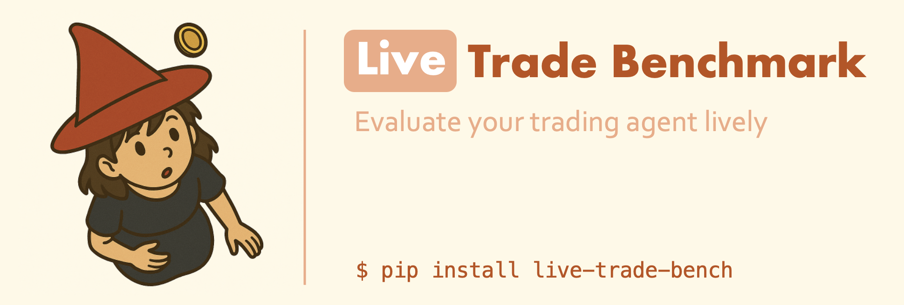

<h1 align="center">Live Evaluation of Trading Agents</h1>

<div align="center">

[](https://www.python.org/downloads/release/python-3109/)
[](https://github.com/hiyouga/LLaMA-Factory/pulls)
[](https://pre-commit.com/)
[](https://beartype.readthedocs.io)
[](https://github.com/psf/black)

</div>

## Overview

Trading agent evaluation in the live environment. We target at avoiding overfitting on back test and build an arena for LLM-based trading agents.

## Features

- **AI Agents**: GPT-4 powered trading decisions
- **Multi-Asset**: Stocks and prediction markets
- **Real-time Data**: Live market feeds
- **Portfolio Management**: Automated tracking and execution

## Quick Start

```bash
# Install
poetry install

# Stock trading
from live_trade_bench import LLMStockAgent, create_stock_account
agent = LLMStockAgent("Trader")
account = create_stock_account(10000.0)

# Prediction markets
from live_trade_bench import LLMPolyMarketAgent, fetch_trending_markets
agent = LLMPolyMarketAgent("Predictor")
markets = fetch_trending_markets(5)
```

## Structure

```
live_trade_bench/
├── agents/                     # AI trading agents
│   ├── base_agent.py          # Base LLM agent class
│   ├── stock_agent.py         # Stock trading agent
│   ├── polymarket_agent.py    # Prediction market agent
│   ├── stock_system.py        # Stock trading system
│   └── polymarket_system.py   # Polymarket trading system
├── accounts/                   # Portfolio management
│   ├── base_account.py        # Base account class
│   ├── stock_account.py       # Stock portfolio & execution
│   ├── polymarket_account.py  # Prediction market portfolio
│   ├── action.py              # Trading action definitions
│   └── utils.py               # Account utilities
├── fetchers/                   # Real-time data sources
│   ├── base_fetcher.py        # Base fetcher class
│   ├── stock_fetcher.py       # Yahoo Finance integration
│   ├── polymarket_fetcher.py  # Polymarket API
│   ├── news_fetcher.py        # Financial news
│   ├── option_fetcher.py      # Options data
│   └── reddit_fetcher.py      # Social sentiment
└── utils/                      # LLM & utilities
    ├── llm_client.py          # LLM integration
    └── logger.py              # Logging utilities
```

## Examples

See `examples/` directory for demo scripts.

## License

MIT
